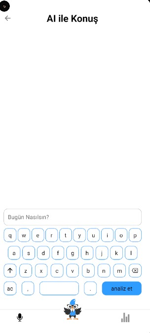
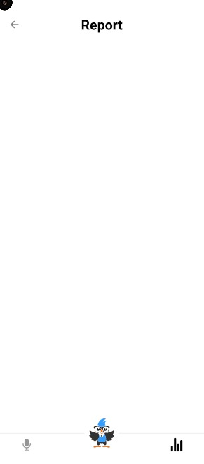
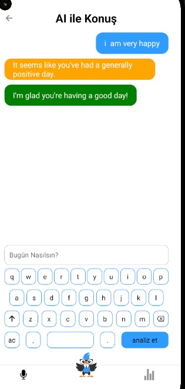
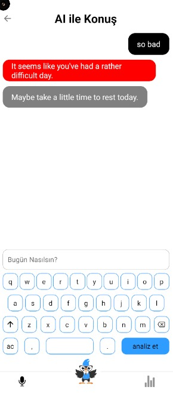
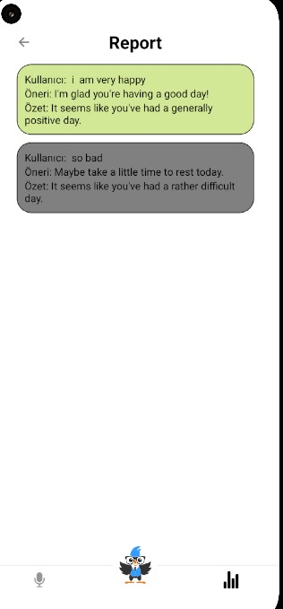

# Konuşarak Öğren – Duygu Analizli Konuşma Asistanı

Bu proje, **React Native CLI** ile geliştirilmiş, kullanıcı cümlelerini AI ile analiz eden bir mobil uygulamadır.  
Kullanıcı yazdığı metni “Analiz Et” butonuyla gönderir, uygulama da cümlenin duygu durumunu (pozitif / negatif) tespit edip Türkçe öneri ve kısa bir özet üretir.  
Önceki analizler cihazda saklanır ve **internet yokken bile geçmiş analizler görüntülenebilir.**

# AI araç kullanımı
Projenin tasarımlarını tamamen kendim yaptım ve yapay zeka entegrasyonu dışında tüm kodları ben oluşturdum. Hugging Face bağlantısını kurmak için önce YouTube üzerindeki eğitim videolarından yararlandım, ardından ChatGPT 5.1 Plus desteğiyle entegrasyonu geliştirip projeye entegre ettim.

---

## 🚀 Özellikler

- React Native CLI tabanlı mobil uygulama
- Klavye bileşeni ile metin girme
- Hugging Face üzerinden AI duygu analizi
  - İngilizce cümleler için: `distilbert-base-uncased-finetuned-sst-2-english`
  - Türkçe cümleler için: `savasy/bert-base-turkish-sentiment-cased`
- Pozitif / negatif duruma göre:
  - Türkçe “öneri” metni
  - Günle ilgili kısa “özet” cümlesi
- **Offline destek:** Analizler AsyncStorage’da saklandığı için internetsizken de geçmiş kayıtlar Report ekranında görülebilir.

---

## 🧰 Teknolojiler

- **React Native CLI**
- **JavaScript**
- **Redux** – input ve entries state yönetimi
- **AsyncStorage** – geçmiş analizleri cihazda saklama
- **Hugging Face Inference API** – duygu analizi modelleri

---

## 📦 Kurulum

### 1. Depoyu klonla

```bash
git clone https://github.com/ElanurToptas/KonusarakOgren.git
cd KonusarakOgren
```

### 2. Bağımlılıkları yükle
```bash
npm install
```

### 3. Gerekli araçlar

Node.js (LTS)

Java (JDK 11+)

Android Studio + Android SDK

Bir Android emülatör veya gerçek cihaz (USB debugging açık)

🔑 Hugging Face Token ve .env

Projede Hugging Face Inference API kullanıldığı için bir User Access Token gerekiyor.

Hugging Face hesabına gir

Settings > Access Tokens bölümünden bir token oluştur

Proje kök dizinine .env dosyası ekle:

```bash
HF_TOKEN=hf_XXXXXXXXXXXXXXXXXXXXXXXX
```
▶️ Çalıştırma Adımları
## Android

# 1.Metro bundler’ı başlat:
```bash
npx react-native start
```

```bash
npx react-native run-android
```

## 🤖 Kullanılan AI Modelleri ve API Açıklaması

Projede Hugging Face üzerinden iki farklı sentiment modeli kullanılır:

# 1. İngilizce Duygu Analizi Modeli

Model: distilbert/distilbert-base-uncased-finetuned-sst-2-english

Endpoint (router):
```bash
https://router.huggingface.co/hf-inference/models/distilbert/distilbert-base-uncased-finetuned-sst-2-english

```
Girdi formatı:
```bash
{ "inputs": "happy" }
```
Çıktı formatı (örnek):
```bash
[
  [
    { "label": "POSITIVE", "score": 0.97 }
  ]
]
```

# 2. Türkçe Duygu Analizi Modeli

Model: savasy/bert-base-turkish-sentiment-cased

Endpoint (router):

```bash
https://router.huggingface.co/hf-inference/models/savasy/bert-base-turkish-sentiment-cased
```

Girdi formatı:
```bash
{ "inputs": "mutluyum" }
```
Çıktı formatı (örnek):
```bash
[
  [
    { "label": "POSITIVE", "score": 0.97 }
  ]
]
```
## 🧠 Uygulama İçindeki AI Akışı

# 1.Kullanıcı metni özel klavyeden yazar.

# 2. “Analiz Et” seçeneğine basınca:

analyzeSentiment(text) fonksiyonu AI servisini çağırır.

Modelden gelen label → "positive" / "negative" gibi.

# 3. Label’a göre:

Öneri (suggestion) metni üretilir (ör: “Güzel bir gün geçirene sevindim”).

Özet (summary) oluşturulur (ör: “Bugün genel olarak olumlu bir gün geçirmişsin”).

# 4. Bu bilgiler newEntry objesi olarak Redux state ve AsyncStorage içine kaydedilir.

# 5. Report ekranında tüm geçmiş analizler listelenir:

Kullanıcı mesajı (entry.text)

Öneri (entry.suggestion)

Özet (entry.summary)

Renkler, entry.aiResult.label pozitif/negatif durumuna göre belirlenir.

## 📡 Offline Davranış

AI isteği için internet gerekir.

Ancak entries AsyncStorage üzerinde tutulduğu için:

Uygulama offline açıldığında bile geçmiş analizler Report ekranında görülebilir.

İnternet yoksa sadece yeni analiz alınamaz, fakat eski kayıtlar korunur.


<table>
  <tr>
    <td></td>
    <td></td>
    <td></td>
  </tr>
  <tr>
    <td></td>
    <td></td>
  </tr>
</table>


